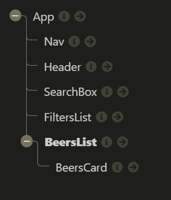

# Feedback

Right click on the file and click Open Preview or `ctrl/cmd + shift + v` to open preview

## Goals

1. Working beers web app - done
2. Practice using API and React - done
3. Application of what you're learning (React, Fetch etc.) - done

## Specification

### Start

> "All the wire frame content in black is the first part of the challenge - that is, the nav, the main section containing the beers and beer cards for each piece of data."



Your component tree looks good you have pretty much matched the component tree in the brief. The aim of this first point is to force you to make multiple components and practice passing props around the application which you have done. This is great!

You have missed a couple out though.


In a application this size there probably are to many components but it is good practice so why not give it a go?

Try adding in these components:

- `<Main/>`
- `<FilterItem/>`

When you are building things in React have a go at breaking your project into a component tree before you go in with the code. It will help you out manage all of the moving pieces and pages.

### Extension 1

> "Once you've got the design and layout sorted to render the elements, it's time to add some search functionality. Make it so you can search the beers by their name, and the page content should update as you type each letter in the box."

The aim of this extension is to get you using functions as props. The function in your app is being passed multiple component levels to your search component. That component is using the function to capture the user input. You are Then using the input to filter your array of beers.

It does have some strange behavior though and that is because you have a little bug in your code.

At the moment you have multiple state changes in one function which is okay but if one of them relies on the other state you can run into problems as updating state can take time. Meaning you become out of sync.

Below you update the search term and then try and use it as well for the filter.

```jsx
// 40 - 52 App.js
const handleInput = event => {
  const inputValue = event.target.value.toLowerCase();
  setSearchTerm(inputValue);

  if (searchTerm === "") {
    return beersArray;
  } else if (searchTerm !== "") {
    const searchResults = beersArray.filter(result => {
      return result.name.toLowerCase().includes(searchTerm);
    });
    setBeersArray(searchResults);
  }
};
```

You are better off letting the `handleInput()` update the state. Then have a `searchResults` variable which is the filter because it will only be ran when the component updates ensuring you have the state that you need to proceed. Then in the return that `searchResults` can be given to e component that needs it.

```jsx
// App.js

const handleInput = event => {
  const inputValue = event.target.value.toLowerCase();
  setSearchTerm(inputValue);
};

const searchResults = beersArray.filter(result => {
  return result.name.toLowerCase().includes(searchTerm);
});

return (
  <div className="App">
    <Nav />
    <Header />
    <SearchBox handleInput={handleInput} searchTerm={searchTerm} />
    <FiltersList filterByABV={filterByABV} filterByPH={filterByPH} />
    <BeersList beersArray={beersArray} />
  </div>
);
```

### Extension 2

> Finally attempt to make it so you can filter the content on three conditions:
>
> > - High Alcohol (ABV value greater than 6%)
> > - Classic Range (Was first brewed before 2010)
> > - High Acidity (pH lower than 4)
> > - If you can’t achieve this after a good attempt, then feel free to move on to the final extension.

Cool this was tricky and you are really close to solving it. You have logic just not in the right place. The solution is similar to the problem above.

Below in your `filterByPH()` you are updating state and then applying a filter. The logic in the filter is correct but it is not being used. Filter does not modify the array it gives you a new one which at the moment you are not using.

```js
const filterByPH = () => {
  setPh(!ph);
  beersArray.filter(beer => {
    return beer.ph < 4;
  });
};
```

You shouldn't set it to state though. If you did eventually you would run out of beer objects.
You can follow the same logic as the point above and just introduce some more logic to the search filter. I have renamed it `filterResults` now every time the state has changed the beers array will be filtered. If your state toggles are true the filter will be applied to the beer object.

```js
// App.js
const filterResults = beersArray.filter(result => {
  let beerHasMatched = true;

  if (searchTerm) {
    beerHasMatched = result.name.toLowerCase().includes(searchTerm);
  }

  if (abv) {
    beerHasMatched = beerHasMatched && result.abv > 6;
  }

  if (ph) {
    beerHasMatched = beerHasMatched && result.ph < 4;
  }

  return beerHasMatched;
});
```

### Extension 3

> Style the website however you see fit! Go wild!

It looks good on a large monitor. You need to address the styles for other devices though mate.


## Overall

Very well componentised code across the board.

You have multiple functions being passed across your application. You just haven't hooked them up yet which we can resolve.

I feel confident with your understanding of props, useState and funcs as props. 

When we catch up you need to let me know which topics you want to look at again and which parts of the solutions above don't make sense.

Awesome mate good going! I can't wait to see what you build next.

## To work on

Update the readme.md so it is not the auto generated file.

The project is a little messy but you can easily tidy it up.

- Remove the `console.log()`
- Remove commented out code.

Final notes, when you run a react app, your terminal shows you warnings. These are generally easily googleable and simple to fix and will improve code quality. So always keep one eye on your terminal while coding in react.
